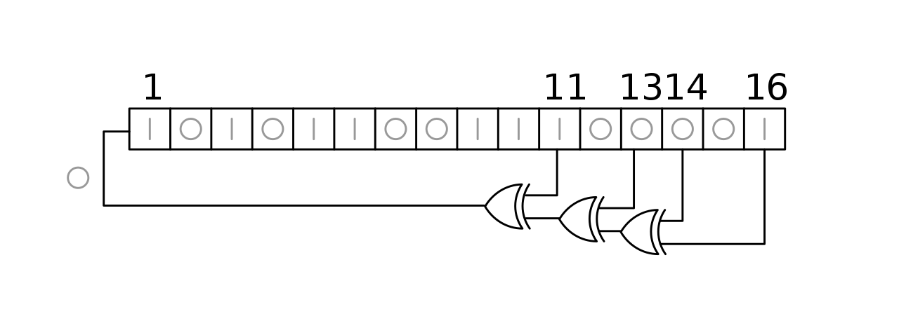

## LFSR Implementation in C

Linear Feedback Shift Registers (LFSRs) are the basic components of many running-key generators for stream cipher applications, because they are appropriate to hardware implementation and they produce sequences with good statistical properties, this means that it gives a good sense of randomness. LFSR refers to a feedback shift register with a linear feedback function.

The configuration of an LFSR consists of a shift register of length N where it is feeded back with a linear combination of certain bits of the register. Usually the linear combination is done with the XOR or XNOR operation. In this case, the feedback is taken from the 11, 13, 14 and 16 bits of the register xor-ed together.

The arrangement of taps for feedback in an LFSR can be expressed in finite field arithmetic as a polynomial mod 2. This means that
the coefficients of the polynomial must be 1s or 0s. This is called the feedback polynomial or reciprocal characteristic
polynomial. For example, if the taps are at the 16th, 14th, 13th and 11th bits (as shown), the feedback polynomial is $x^{16} + x^{14} + x^{13} + x^{11} + 1$

### Implementation

Implement the following sequence generators using LFSRs in C:

- 3 bit LFSR with feedback polynomial $x^3 + x^2 + 1$
- 8 bit LFSR with feedback polynomial $x^8 + x^6 + x^5 + x^4 + 1$
- 16 bit LFSR with feedback polynomial $x^{16} + x^{14} + x^{13} + x^{11} + 1$

- Use the `lfsr.h` file to implement your function

The LFSR needs an initial state, which is called seed. The seed is the initial value of the register, and it is used to generate the
first output of the LFSR. The seed is also used to generate the next state. Fill the table below using the following seed values:

| **LFSR** | **Q** | **Q+1** | **Q+2** | **Q+3** | **Q+4** |
|----------|-------|---------|---------|---------|---------|
|          | 0x0   |         |         |         |         |
| 3 bit    | 0x1   |         |         |         |         |
|          | 0x2   |         |         |         |         |
|          | 0x3   |         |         |         |         |
|----------|-------|---------|---------|---------|---------|
|          | 0x00  |         |         |         |         |
| 8 bit    | 0xAA  |         |         |         |         |
|          | 0x33  |         |         |         |         |
|          | 0xFF  |         |         |         |         |
|----------|-------|---------|---------|---------|---------|
|          | 0x0000|         |         |         |         |
| 16 bit   | 0x3333|         |         |         |         |
|          | 0x5555|         |         |         |         |
|          | 0xA354|         |         |         |         |

- - -

- [Next-True Random Number Generator (TRNG)](../3_trng/README.md)
- [Previous-Linear Congruential Generator (LCG)](../1_lcg/README.md)
- [Main](../README.md) - Overview of the project and its contents
