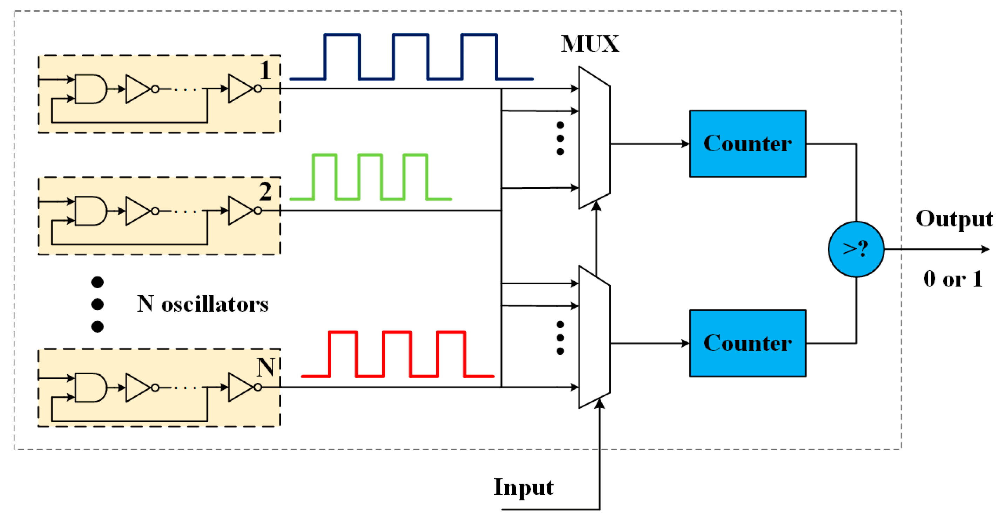
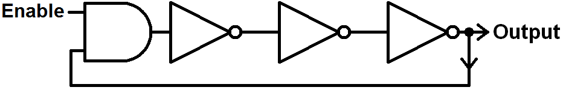
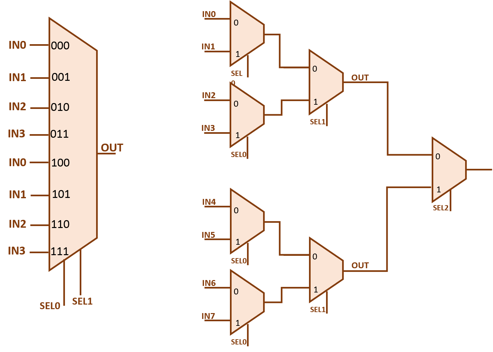

# Lab 5

## Physical Unclonable Functions

### Introduction

Physical Unclonable Functions (PUFs) are physical systems that take advantage of the inherent
randomness in the system to generate unique identifiers. PUFs are used in many applications, such as
secure key generation, device authentication, and anti-counterfeiting. PUFs are essential for
hardware security, we can categorize PUFs into two main categories: weak and strong PUFs. Weak PUFs
are used to generate a unique identifier for a device, while strong PUFs are used to generates a
cryptographic key. In this lab, we will implement an `8-bit` weak PUF using a ring oscillator. The
weak PUF that you will implement in this lab is shown in the Figure below. The PUF consists of 4
hardware modules.

* **Ring Oscillators Array**: This module consists of 2 sets of 16 ring oscillators. Each ring
  oscillator generates a periodic signal with a frequency determined by the delay of the inverters.
  The frequency of the ring oscillator is used to generate the response of the PUF.
* **2 Multiplexers**: These modules selects one of the ring oscillators of the array. The selected
  ring oscillator is used to generate the response of the PUF. The multiplexers are controlled by
  the challenge. The upper bits of the challenge select the first multiplexer, while the lower bits
  of the challenge select the second multiplexer. Since in this case we have 16 ring oscillators
  we need 4 bits to select the ring oscillator and the challenge is 8 bits long, we need to split
  the challenge in two parts.
* **2 Counters**: These modules count the number of cycles of the ring oscillators, since the ring
  oscillators have different delays, the number of cycles will be different for each ring
  oscillator.
* **Comparator**: This module compares the result of the counters and generates the bit of the
  response.

#### Implementation

Implement the PUF described above in Verilog. The PUF should have the following ports: `Enable,
Reset, Clock, Challenge, Response`. Name your module `ro_puf`. Use the testbench found in the
'tb' folder to test the PUF module. The PUF should be a synchronous PUF, this means that the output
should only change when the clock signal is high. The PUF should be implemented using the `always`
block. The PUF should have the following behavior:

* When the enable signal is high, the PUF should start the oscillation of the ring oscillators.
* The challenge should be used to select the ring oscillators.
* The response should be generated by the comparator.
* The response should be generated when the enable signal is high and the challenge is stable.

*Ring Oscillator PUF*

The PDF file below shows the simulation of the PUF. The top signal is the clock signal, the second
signal is the reset signal, the third signal is the enable signal, the fourth signal is the
challenge signal, the fifth signal is the response signal. The simulation shows the behavior of the
PUF when the enable signal is high and the challenge. Every time that the clock signal changes from
low to high, there is a new challenge applied to the PUF and the response of the previous challenge
is generated.

[**Ring Oscillator PUF Simulation (PDF)**](./out_ro_puf.pdf)  
*Ring Oscillator PUF Simulation*

### Ring Oscillator

A ring oscillator is a circuit that generates a periodic signal by connecting an odd number of
inverters in a loop. Since the inverters have a delay, the signal will oscillate at a frequency
determined by the delay of the inverters. It is well known that each individual inverter has
different physical characteristics. This means that even though the inverter are identical, they
have variations during the manufacturing process. These variations manifest in the delay of each
inverter.

#### Implementation

Implement a ring oscillator in Verilog using 15 inverters. The delay of each inverter should be a
random number between 30 and 40 picoseconds. This module should have 2 ports: an `Enable` input signal and
an `Oscillation` output signal. The output signal should be the oscillating signal generated by the
inverters connected in a loop. Use the schematic in the Figure below as a reference for your
design. The enable signal should be used to start and stop the oscillation. Use the testbench found
in the 'tb' folder to test the ring oscillator module.

*Ring Oscillator*

#### Important Notes

* Name your module `ring_oscillator`
* Use ``timescale 1ps / 1ps`` at the beginning of your Verilog file, for setting the time unit and
  time precision to picoseconds of your delay values.
* The delay of each inverter should be a random number between 30 and 40 picoseconds.
* Delays can be simulated using `$urandom_range(low_limit, upper_limit)` function.
* To simulate the delay of a logic gate you can use the `#` operator followed by the delay value.
  for example, `assign c #10 = a & b` will delay the signal by 10 picoseconds to the and gate.
* Combine the 2 last bullet points to generate the delay of the inverter.
* Note that this is only for simulation purposes, in real hardware the delay is determined by the
  physical characteristics of the inverter. This is not going to be synthesize in real hardware. If
  you use this in a real design, the synthesis tool will ignore the delay.

### Multiplexer

A multiplexer is a combinational circuit that selects one of the input signals and forwards it to
the output. The selection of the input signal is controlled by a set of selection lines. The number
of selection lines determines the number of input signals that can be selected. In this case, we
will implement a 16 to 1 multiplexer. Use the 8 bit multiplexer shown in the Figure below as a
reference for your design.

*8 bit Multiplexer*

#### Implementation

Implement a 16 to 1 multiplexer in Verilog. The multiplexer should have the following ports:
`Select, DataInput, DataOutput`. Name your module `mux`. Use the testbench found in the 'tb' folder
to test the multiplexer module.

### Counter

A counter is a sequential circuit that increase the value of the internal register by one every time
that the clock signal changes from low to high or viceversa. In this case, we will implement a
counter that counts the number of cycles of the ring oscillator. The counter should have a reset
signal that resets the counter to 0.

#### Implementation

Implement a 8 bit counter in Verilog. The counter should have the following ports: `Enable, Reset,
Clock, Output`. Name your module `counter`. Use the testbench found in the 'tb' folder to test the
counter module. A counter is a sequential circuit, so you need to use the `always` block to
implement the counter. The counter should be a synchronous counter, this means that the counter
should only increment when the clock signal is high.

### Comparator

A comparator is a piece of hardware that compares two digital numbers and generates a signal
indicating if the port A is greater or equal to port B. In this case, we will implement a comparator
that compares the output of the two counters, if the counter A is greater or equal to the counter B,
the output of the comparator should be 1, otherwise, the output will be 0.

#### Implementation

Implement a 8 bit comparator in Verilog. The comparator should have the following ports: `Enable,
Reset, Clock, PortA, PortB, Output`. Name your module `comparator`. Use the testbench found in the
'tb' folder to test the comparator module. This is a synchronous comparator, so the output should
only change when the clock signal is high. The comparator should be implemented using the `always`
block.

